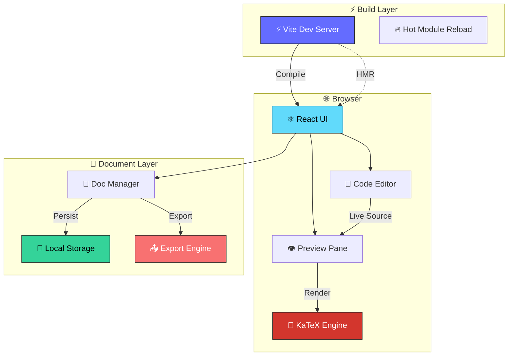

<div align="center">

<!-- Animated Logo SVG -->


# ✨ Quarkdown Web

### *A browser-based editor and live preview workspace for Quarkdown documents*

---

<!-- Badges -->
<a href="https://github.com/anshverma1975/web-quark/stargazers">
  
</a>
<a href="https://github.com/anshverma1975/web-quark/network/members">
  
</a>
<a href="https://github.com/anshverma1975/web-quark/issues">
  
</a>
<a href="https://github.com/anshverma1975/web-quark/pulls">
  
</a>
<a href="LICENSE">
  
</a>
<br/>
<a href="https://github.com/anshverma1975/web-quark/actions">
  
</a>
<a href="https://www.typescriptlang.org/">
  
</a>
<a href="https://vitejs.dev/">
  
</a>
<a href="https://katex.org/">
  
</a>

</div>

<br/>

<!-- Animated Divider -->
<div align="center">


'"/>

</div>

<br/>

## 🎯 What is Quarkdown Web?

<table>
<tr>
<td width="50%" valign="top">

**Quarkdown Web** is a powerful, browser-based editor that brings the Quarkdown document ecosystem to the web. Edit on the left, preview on the right — it's that simple.

Built with ❤️ using **React**, **Vite**, and **KaTeX**, it provides a seamless writing experience for technical documents, presentations, and more.

<br/>

### 🚀 Quick Start

```bash
# Clone the repository
git clone https://github.com/anshverma1975/web-quark.git

# Navigate to the frontend
cd web-quark/frontend

# Install dependencies
npm install

# Start the dev server
npm run dev
```

> 🌐 Open **[http://localhost:4000](http://localhost:4000)** and start writing!

</td>
<td width="50%" valign="top">

```
┌─────────────────────────────────────────┐
│  ⚡ Quarkdown Web                       │
├──────────────────┬──────────────────────┤
│                  │                      │
│   📝 EDITOR      │   👁️ PREVIEW         │
│                  │                      │
│   # Hello        │   Hello              │
│   $E=mc^2$       │   E=mc²             │
│                  │                      │
│   Write here...  │   Live rendering...  │
│                  │                      │
├──────────────────┴──────────────────────┤
│  📁 Docs  │  📄 Export  │  ⚙️ Settings  │
└─────────────────────────────────────────┘
```

</td>
</tr>
</table>

<br/>

---

<br/>

## ✨ Features

<div align="center">

<table>
<tr>
<td align="center" width="33%">

### 👁️ Live Preview
Edit Quarkdown source on the left, see rendered output instantly on the right. No refresh needed.

<br/>


</td>
<td align="center" width="33%">

### 📄 Multiple Doctypes
Support for **plain**, **paged**, **slides**, and **docs** modes.

<br/>


</td>
<td align="center" width="33%">

### 🔢 LaTeX Math
Inline `$...$` and display `$$...$$` rendering powered by **KaTeX**.

<br/>


</td>
</tr>
<tr>
<td align="center">

### ⚡ Custom Functions
Define and call reusable Quarkdown functions for maximum productivity.

<br/>


</td>
<td align="center">

### 📤 Export Options
Copy HTML, download as `.html`, or print to **PDF** — your content, your format.

<br/>


</td>
<td align="center">

### 📁 Document Management
Full sidebar with create, rename, and delete support for your documents.

<br/>


</td>
</tr>
</table>

</div>

<br/>

---

<br/>

## 🛠️ Tech Stack

<div align="center">

| Layer | Technology | Purpose |
|:---:|:---:|:---|
| ⚛️ | **React 18** | UI framework with component-based architecture |
| ⚡ | **Vite 5** | Lightning-fast HMR and optimized builds |
| 🔢 | **KaTeX** | High-performance LaTeX math rendering |
| 🎨 | **Lucide React** | Beautiful, consistent icon set |
| 📝 | **JSX** | Component markup and rendering |

<br/>


</div>&quot;'/>'"/>

</div>

<br/>

---

<br/>

## 🏗️ Architecture



<br/>

---

<br/>

## 🚀 Production Build

### Building for Production

```bash
cd frontend
npm run build
```

> 📦 Production files are generated in `frontend/dist`

### Deploying to Vercel

<table>
<tr>
<td width="30%" align="center">


</td>
<td>

| Setting | Value |
|:---|:---|
| **Root Directory** | `frontend` |
| **Build Command** | `npm run build` |
| **Output Directory** | `dist` |
| **Install Command** | `npm install` |

> 💡 When importing into Vercel, set the **Root Directory** to `frontend`.

</td>
</tr>
</table>

<br/>

---

<br/>

## 📂 Project Structure

```
web-quark/
├── 📁 frontend/
│   ├── 📁 src/
│   │   ├── 📁 components/      # React components
│   │   ├── 📁 lib/             # Utility libraries
│   │   ├── 📄 App.jsx          # Main application
│   │   ├── 📄 App.css          # Global styles
│   │   └── 📄 index.jsx        # Entry point
│   ├── 📄 index.html           # HTML template
│   ├── 📄 package.json         # Dependencies
│   └── 📄 vite.config.js       # Vite configuration
├── 📄 README.md                # This file
└── 📄 .gitignore
```

<br/>

---

<br/>

## 🤝 Contributing

<div align="center">

Contributions are **welcome** and **appreciated**! Here's how you can help:

<table>
<tr>
<td align="center" width="25%">

### 🐛 Bug Reports
Found a bug? Open an issue with steps to reproduce.

</td>
<td align="center" width="25%">

### ✨ Feature Requests
Have an idea? We'd love to hear it!

</td>
<td align="center" width="25%">

### 🔧 Pull Requests
Fork, code, test, and submit a PR.

</td>
<td align="center" width="25%">

### 📖 Documentation
Help improve our docs and examples.

</td>
</tr>
</table>

<br/>


</div>

<br/>

---

<br/>

## 🙏 Attribution

<div align="center">

<table>
<tr>
<td align="center" width="30%">


</td>
<td>

This project is built for the **Quarkdown** ecosystem and acknowledges the original Quarkdown project by **[@iamgio](https://github.com/iamgio/quarkdown)**.

Please refer to the upstream repository for the Quarkdown language, documentation, and license information.

</td>
</tr>
</table>

</div>

<br/>

---

<br/>

## ⭐ Show Your Support

If you find this project helpful, please give it a ⭐ on GitHub! It helps others discover the project and motivates us to keep building.

<div align="center">


<br/>

---

<br/>

<div align="center">

<a href="https://ansh-space.vercel.app" target="_blank" rel="noopener noreferrer" style="display:inline-flex;align-items:center;gap:5px;padding:6px 11px;border-radius:6px;border:1px solid #1e293b;background:rgba(10,10,18,.95);font-family:ui-monospace,'Cascadia Code',Consolas,monospace;font-size:11.5px;text-decoration:none;color:#64748b;margin-top:1.5rem">
  <span style="color:#a78bfa;font-weight:600">$</span>
  <span>made with</span>
  <svg width="11" height="11" viewBox="0 0 24 24" fill="#f43f5e" aria-hidden="true"><path d="M19 14c1.49-1.46 3-3.21 3-5.5A5.5 5.5 0 0 0 16.5 3c-1.76 0-3 .5-4.5 2-1.5-1.5-2.74-2-4.5-2A5.5 5.5 0 0 0 2 8.5c0 2.3 1.51 4.04 3 5.5l7 7Z"/></svg>
  <span>by</span>
  <span style="font-weight:800;color:#ec4899;text-shadow:0 0 5px #ec4899,0 0 8px #ec4899,0 0 16px #ec4899,0 0 32px #db2777;letter-spacing:1px">ANSH</span>
</a>

<br/>

> *"Write beautifully. Preview instantly. Export effortlessly."*

---

*Built with the Quarkdown ecosystem • Powered by Vite + React + KaTeX*

</div>

</div>
